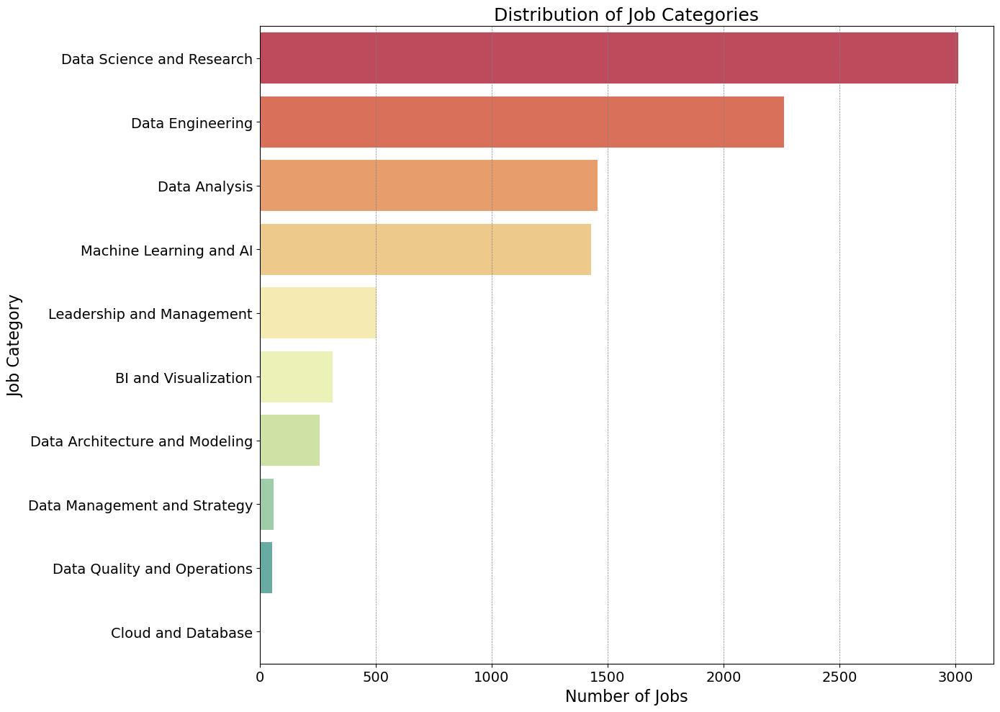
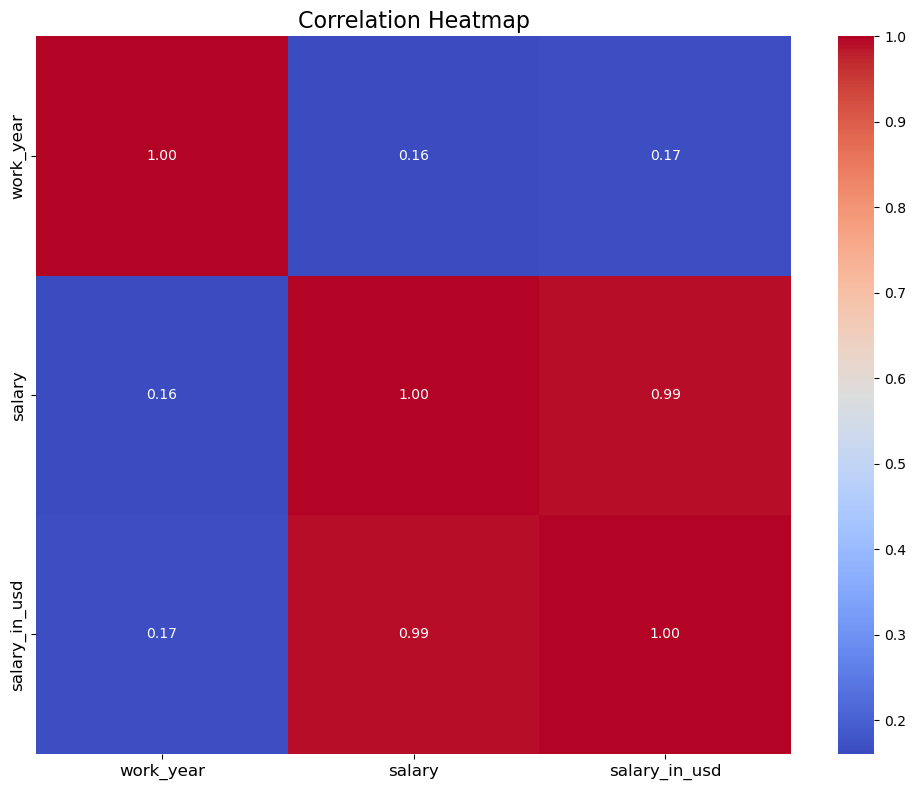
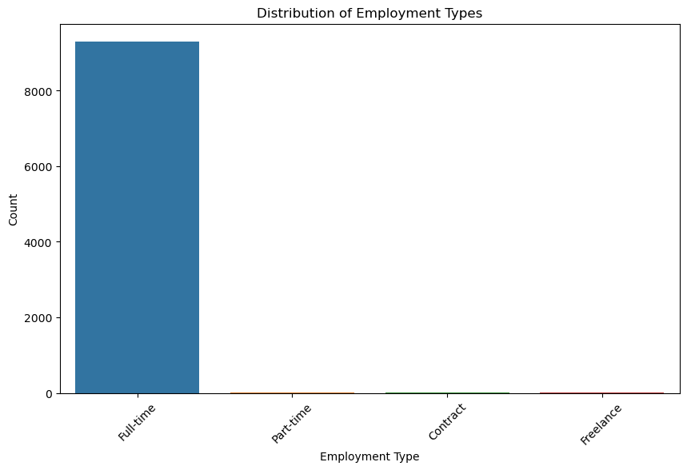
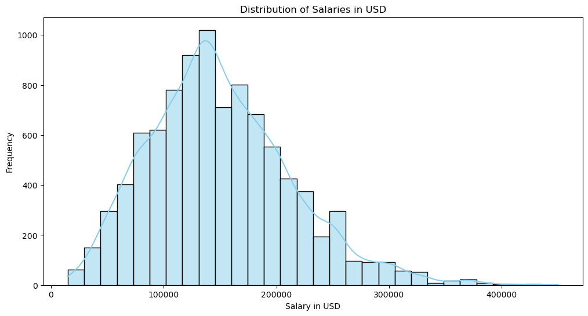
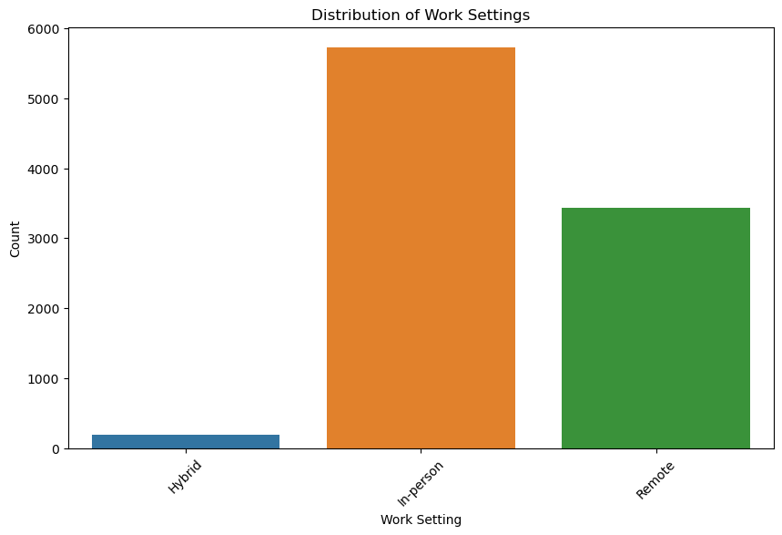
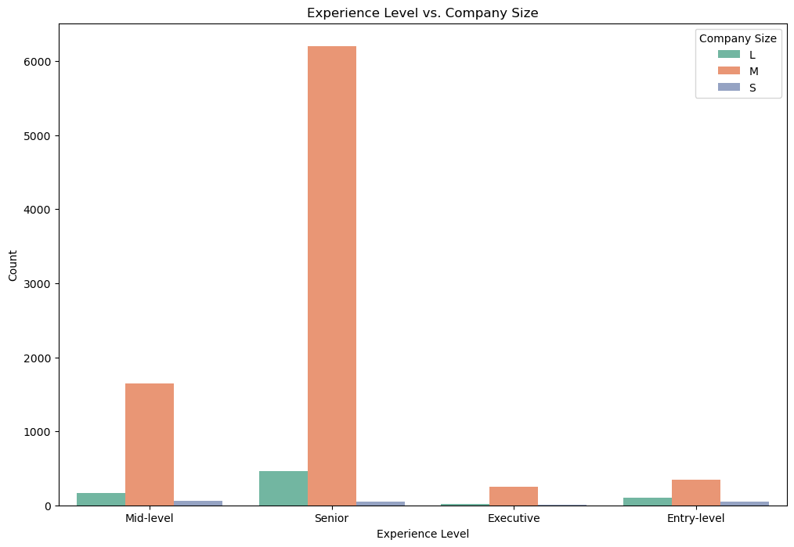
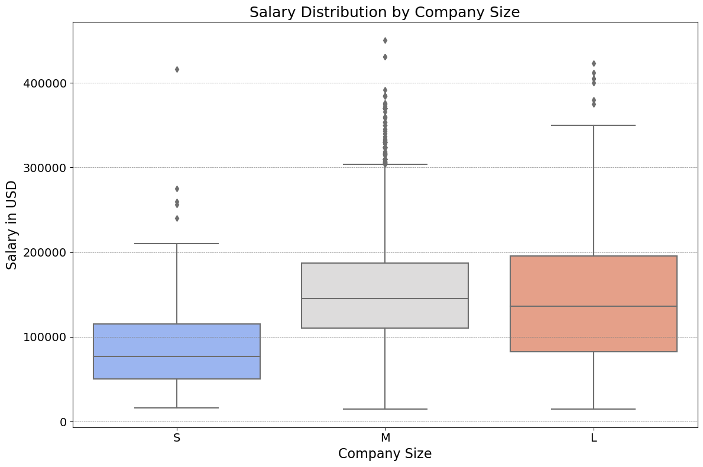
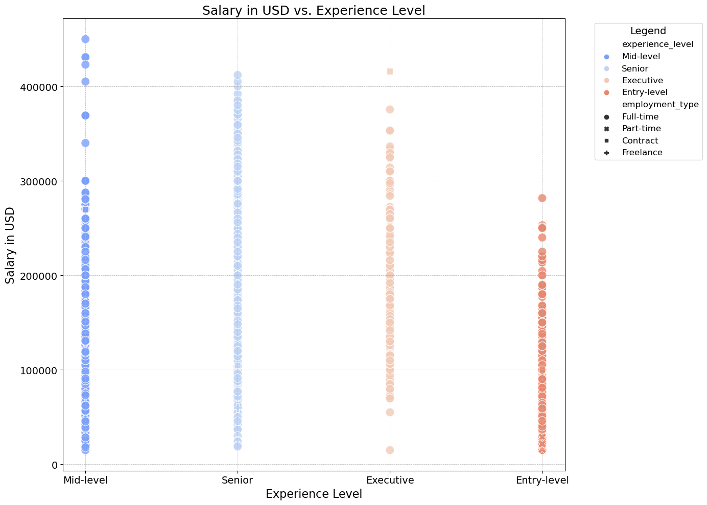
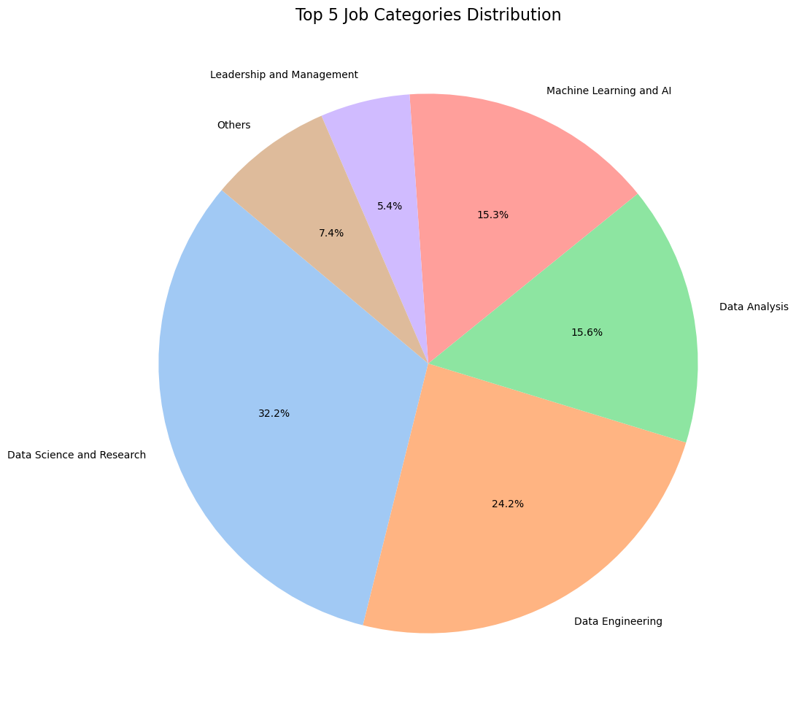

# Introduction

This repository contains a series of visualizations derived from a dataset focused on jobs within the data industry. The visualizations aim to provide comprehensive insights into employment types, salary distributions, work settings, experience levels, job categories, and company sizes within the field. The dataset captures various aspects of the data job market, offering valuable information for both job seekers and employers alike. The goal is to enable informed decision-making for individuals looking to advance their careers in data-related roles and for organizations aiming to understand the current job market trends.

# Dataset Overview

The `jobs_in_data.csv` dataset is a collection of job listings, employee statistics, and salary information within the data industry. It includes variables such as work experience, employment type, salary in USD, work setting (remote, in-person, hybrid), company size, and job category. The dataset provides a snapshot of the industry, highlighting the dynamics of job availability, preference for work environments, and the remuneration patterns associated with different job roles and experience levels.

Key attributes of the dataset include:

- `work_year`: The year in which the work was carried out or the job listing was posted.
- `salary`: The salary offered for the job, possibly in local currency.
- `salary_in_usd`: The salary converted to USD for standardization.
- `employment_type`: The nature of the employment contract, such as full-time, part-time, contract, or freelance.
- `company_size`: Categorized as small (S), medium (M), or large (L), providing insight into the scale of operations and potential organizational structures.
- `experience_level`: Classified into categories such as entry-level, mid-level, senior, or executive, giving an indication of the professional seniority required or offered by the job.

The visualizations derived from this dataset aim to tell a story about the current state of the data job market, reflect on the industry's standards, and potentially forecast future trends.

### Distribution of Job Categories In Data Sector

#### Description
This bar chart categorizes the number of jobs into different data-related fields such as 'Data Science and Research', 'Data Engineering', and so on. It helps in understanding the demand for different specializations.

#### Conclusion
'Data Science and Research' category jobs are the most numerous, indicating a high demand for these skills.

---

### Correlation Heatmap

#### Description
The correlation heatmap provides a visual representation of the correlation coefficients between different variables in the dataset. In this case, variables include 'work_year', 'salary', and 'salary_in_usd'. A coefficient of 1 indicates a perfect positive correlation, while 0 indicates no correlation. Values close to 1 suggest a strong positive correlation. The heatmap shows that 'salary' and 'salary_in_usd' are almost perfectly correlated, which is expected since they are likely to be different representations of the same underlying value.

#### Conclusion
'Salary' and 'salary_in_usd' have a high correlation, suggesting redundancy, while 'work_year' has little to no correlation with salary figures, indicating that years of work do not have a strong linear relationship with the salary.

---

### Distribution of Employment Types

#### Description
This bar chart illustrates the distribution of different employment types within the dataset. The employment types shown are 'Full-time', 'Part-time', 'Contract', and 'Freelance'. It's evident that 'Full-time' employment is the most common among the data collected.

#### Conclusion
The majority of employment in this dataset is full-time, indicating that other forms of employment such as part-time, contract, and freelance are less common in this sector.

---

### Distribution of Salaries in USD

#### Description
The histogram showcases the frequency distribution of salaries in USD. It illustrates how often salaries within certain ranges appear within the dataset. The distribution appears to be right-skewed, indicating that most salaries are clustered around the lower to mid-range, with fewer individuals earning higher salaries.

#### Conclusion
Salaries are predominantly in the lower to mid-range, with fewer individuals earning significantly higher amounts, suggesting a potential gap between different levels of earners.

---

### Distribution of Work Settings

#### Description
This bar chart displays the count of different work settings such as 'Hybrid', 'In-person', and 'Remote'. It provides insights into the prevalence of each work setting type within the dataset.

#### Conclusion
'In-person' work settings dominate the dataset, with 'Remote' being also significant, indicating a potential trend or preference in the industry.

---

### Experience Level vs. Company Size

#### Description
The grouped bar chart compares the count of different experience levels against the size of the companies (Small, Medium, Large). This can help identify trends in hiring practices among different sizes of companies.

#### Conclusion
Larger companies seem to hire more senior-level and executive roles, while entry and mid-level positions are more evenly distributed across company sizes.

---

### Salary Distribution by Company Size

#### Description
The box plot visualizes the distribution of salaries by company size (Small, Medium, Large). It shows the median, quartiles, and outliers for the salaries in each category.

#### Conclusion
Larger companies tend to offer higher median salaries with a wider range, as indicated by the box size and the presence of outliers.

---

### Salary in USD vs. Experience Level

#### Description
This scatter plot visualizes individual salary points against experience levels, differentiated by employment type (Full-time, Part-time, etc.). It can be used to infer the relationship between experience and salary as well as how different employment types compare.

#### Conclusion
Salaries tend to increase with higher experience levels, and full-time roles typically offer higher salaries compared to other types of employment.

---

### Top 5 Job Categories Distribution

#### Description
The pie chart displays the percentage distribution of the top 5 job categories in the dataset. Each slice represents the proportion of jobs in a particular category like 'Data Science and Research', 'Data Engineering', etc.

#### Conclusion
The job market is dominated by 'Data Science and Research' roles, followed by 'Data Engineering' and 'Data Analysis', indicating a strong market demand for these areas.

